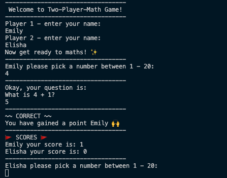
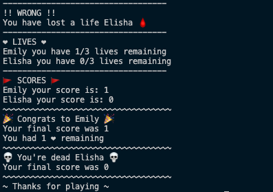

# Two Player Math Game

Welcome to 'Two Player Math Game'! Two players must take turns to solve quick addition problems. Each turn, a number between 1 and 20 is given by a player, which prompts a new question. They must answer correctly to stay in the game - a wrong answer costs a precious life. Lose all three and the game is over! Who will prove their math mastery and claim victory in this arithmetic showdown? 💪

# Screenshots
#### Start of the game:

#### End of the game:

## How to start
Input `ruby main.rb` into terminal to start game.
